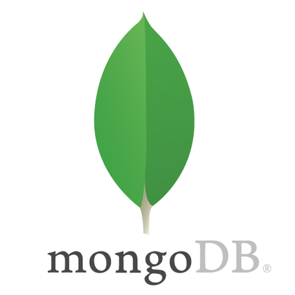

# TRABALHO FINAL DE DAW

**Grupo:  Isabela Cristina, Kaio Fernandes, Erick Pedrosa, Alisson Horta e Eduardo Evangelista.**

Esse seminários tem como objetivo apresentar aos colegas de turma as ferramentas existentes para o desenvolvimento de sistemas web. 
Para isso seu grupo deverá realizar uma pesquisa sobre um dos temas propostos e elaborar uma apresentação sobre o tema escolhido.

## INTRODUÇÃO

O MongoDB é um banco de dados não-relacional orientado a documentos — ou seja, que não se utiliza de tabelas e colunas pré-definidas, mas armazena documentos em formato JSON, que por sua vez, trazem a definição da própria estrutura. 
Dessa maneira, o funcionamento é similar ao de um banco de dados relacional, porém os desenvolvedores definem de que forma querem construir a estrutura dos documentos e coleções, sem que seja necessário estabelecer um padrão previamente.
Lançado em 2009, ele foi desenvolvido na linguagem C++, e possui código aberto (open source). Também é uma ferramenta muito versátil, que pode ser utilizada nas principais ferramentas de cloud computing como Aws, Azure e Google Cloud, por meio do MongoDB Atlas.
Além disso, é suportado pelas principais linguagens de programação e frameworks, como C#, Python, .Net, Java, Node.JS e PHP.
Atualmente, o MongoDB é utilizado por grandes empresas do mercado, como Github, Forbes, Toyota, EA Games, Foursquare, Globo.com, Mercado Livre, Zap Imóveis, TIM, entre muitas outras.

No MongoDB, os bancos de dados são compostos por uma série de coleções, que por sua vez, são formadas por documentos. Abaixo, confira cada um desses elementos e o seu funcionamento.

- Documentos: Tratam-se de versões binárias do JSON, chamadas de BSON. São compostas por pares de chave e valor. 
- Coleções: São grupos de documentos. No MongoDB, essas estruturas equivalem às tabelas dos bancos de dados relacionais.
- Database: Os servidores do MongoDB podem armazenar diferentes databases, que são contêineres que armazenam diversas coleções.

## INSTALAÇÃO E CONFIGURAÇÃO

O processo de instalação do MongoDB no Windows é muito simples e intuitivo, basta seguir as seguintes etapas:

**Instalação do MongoDB:**
**1 - Baixar o MongoDB:**
Acesse o site oficial do MongoDB em ttps://www.mongodb.com/try/download/community.
Selecione a versão do MongoDB Community Server apropriada para o seu sistema operacional (no caso o Windows).
Baixe o instalador.

**2 - Instalar o MongoDB:**
Execute o instalador que você baixou.
Siga as instruções do assistente de instalação.
Certifique-se de selecionar a opção para instalar o MongoDB como um serviço do Windows durante a instalação.

**3 - Configurar o diretório de dados:**
Durante a instalação, você pode escolher o diretório onde os dados do MongoDB serão armazenados. Por padrão utilizamos o diretório ‘C:\data\db.’

**4 - Adicionar o MongoDB ao PATH:**
Para facilitar o uso do MongoDB a partir da linha de comando, adicione o diretório bin do MongoDB ao seu PATH, através do painel de controle do seu computador em sistemas e após isso variáveis de ambiente.
Abra o "Prompt de Comando" como administrador.
Execute o seguinte comando (substituindo ‘<caminho-do-mongodb-bin>’ pelo caminho real onde o MongoDB está instalado), como no exemplo abaixo:
setx /m path "%path%;<caminho-do-mongodb-bin>".
Isso permite que você execute comandos do MongoDB a partir de qualquer local no Prompt de Comando.

**Iniciar o MongoDB:**
**1 - Iniciar o serviço do MongoDB:**
Abra o "Prompt de Comando" como administrador.
Execute o seguinte comando para iniciar o serviço do MongoDB:
net start MongoDB

**Conectar-se ao MongoDB:**
**1 - Abrir o Shell do MongoDB:**
Abra o "Prompt de Comando" e execute o seguinte comando para abrir o shell do MongoDB:
mongo
Agora, você está conectado ao seu servidor MongoDB local e pronto para usar esse excelente banco de dados.

## GETTING STARTED

Este é um script em JavaScript que utiliza o pacote `mongodb` para interagir com um banco de dados MongoDB. O código realiza várias operações, desde a criação de coleções até a inserção de dados nelas. Vou explicar o código por partes:

1. *Importação do módulo `mongodb` e definição das informações de conexão:*
   javascript
   const { MongoClient } = require('mongodb');

   const url = 'mongodb://127.0.0.1:27017';
   const dbName = 'Banco';
   const collectionName1 = 'Agências';
   const collectionName2 = 'Clientes';
   const collectionName3 = 'Contas';
   const collectionName4 = 'Transações';
   

   Aqui, o módulo `mongodb` é importado, e são definidas as informações de conexão, nome do banco de dados e os nomes das coleções.

2. *Função principal `criarBanco()`:*
   javascript
   async function criarBanco() {
     // Criação do cliente MongoDB
     const client = new MongoClient(url);

     try {
       // Conexão com o MongoDB
       await client.connect();
       console.log('Conectado ao servidor MongoDB');

       // Acesso ao banco de dados
       const db = client.db(dbName);

       // Criação das coleções
       await criarColecao(db, collectionName1);
       await criarColecao(db, collectionName2);
       await criarColecao(db, collectionName3);
       await criarColecao(db, collectionName4);

       // Adição de informações nas coleções
       // ...

       // Listagem do conteúdo de cada coleção
       // ...

       // Busca por uma informação na coleção
       // ...
     } catch (error) {
       console.error('Erro:', error);
     } finally {
       // Fechamento da conexão
       await client.close();
       console.log('Conexão fechada');
     }
   }
   

   Essa função principal cria uma instância do cliente MongoDB, conecta-se ao servidor, acessa o banco de dados, cria as coleções e executa operações como adicionar informações, listar o conteúdo das coleções e realizar uma busca.

3. *Função `criarColecao(db, collectionName)`:*
   javascript
   async function criarColecao(db, collectionName) {
     const collections = await db.collections();

     if (!collections.map(c => c.collectionName).includes(collectionName)) {
       await db.createCollection(collectionName);
       console.log(`Coleção ${collectionName} criada.`);
     } else {
       console.log(`Coleção ${collectionName} já existe.`);
     }
   }
   

   Esta função verifica se a coleção já existe no banco de dados. Se não existir, ela cria a coleção.

4. *Funções para adicionar dados nas coleções (`addDB`, `addAgencia`, `addCliente`, `addConta`, `addTransacao`):*
   javascript
   async function addDB(db, json, collectionName) {
     const collection = db.collection(collectionName);
     const inserirResultado = await collection.insertOne(json);
     console.log(`Novo elemento inserido na coleção ${collectionName}:`, inserirResultado.insertedId);
   }

   async function addAgencia(db, json) {
     await addDB(db, json, 'Agências');
   }

   // Funções similares para outras coleções
   

   Essas funções adicionam dados nas coleções correspondentes.

5. *Funções para buscar e listar dados nas coleções (`search` e `list`):*
   javascript
   async function search(db, collectionName, key, val) {
     const collection = db.collection(collectionName);
     let obj = {};
     obj[key] = val;
     const query = await collection.find(obj).toArray();
     console.log(`Resultados da busca na coleção ${collectionName} por ${key}:`, query);
   }

   async function list(db, collectionName) {
     const collection = db.collection(collectionName);
     const query = await collection.find({}).toArray();
     console.log(`Todos os elementos da coleção ${collectionName}:`, query);
   }
   

   Essas funções realizam busca e listagem de dados nas coleções com base em critérios específicos.

6. *Definição de dados para inserção nas coleções:*
   javascript
   const novoCliente = { /* ... */ };
   const novaAgencia = { /* ... */ };
   // Definição de outros dados
   

   Aqui são definidos objetos de dados que serão inseridos nas coleções.

7. *Chamada da função principal:*
   javascript
   criarBanco();
   

   Finalmente, a função principal `criarBanco` é chamada para executar o script.

## FERRAMENTAS SIMILARES

###1) RethinkDB:
É um sistema de gerenciamento de banco de dados NoSQL (Not Only SQL) open-source, projetado para armazenar, consultar e interagir com dados JSON. Ele pertence à categoria de bancos de dados orientados a documentos e foi projetado para oferecer suporte à escalabilidade horizontal, o que significa que pode ser facilmente dimensionado adicionando mais hardware à medida que a carga de trabalho aumenta.
O RethinkDB e o MongoDB são ambos sistemas de gerenciamento de banco de dados NoSQL, o que significa que eles compartilham algumas características fundamentais, especialmente em comparação com bancos de dados relacionais tradicionais. Aqui estão algumas semelhanças entre o RethinkDB e o MongoDB:
**Modelo de Dados JSON:** Ambos os bancos de dados são orientados a documentos e armazenam dados no formato JSON (ou formatos relacionados, como BSON no caso do MongoDB). Isso oferece flexibilidade aos desenvolvedores para lidar com dados complexos e aninhados.
Esquema Dinâmico: Tanto o RethinkDB quanto o MongoDB permitem um esquema dinâmico, o que significa que você pode adicionar campos aos documentos sem a necessidade de uma estrutura de tabela predefinida, como em bancos de dados relacionais.
**Escalabilidade Horizontal:** Ambos os sistemas são projetados para escalar horizontalmente, o que significa que você pode adicionar mais servidores para lidar com um aumento na carga de trabalho. Isso é útil para aplicativos que precisam escalar conforme a demanda aumenta.
**Operações em Tempo Real:** Tanto o RethinkDB quanto o MongoDB oferecem suporte a operações em tempo real. Isso significa que eles podem notificar automaticamente os clientes quando os dados são alterados, o que é útil para construir aplicativos em tempo real.
Comunidades Ativas: Ambas as tecnologias têm comunidades ativas de desenvolvedores e uma variedade de recursos, incluindo documentação extensiva, tutoriais e suporte da comunidade.

###2) Redis:
O Redis é um sistema de armazenamento de dados em memória de código aberto, que também pode ser usado como banco de dados, cache e corretor de mensagens. Ele é conhecido por ser extremamente rápido e eficiente, pois armazena dados na RAM (memória principal) em vez de em discos, o que permite acesso rápido aos dados. O Redis foi desenvolvido para ser uma estrutura de dados em memória com várias estruturas de dados, como strings, hashes, listas, conjuntos, conjuntos ordenados, bitmaps e hiperloglog.
O Redis e o MongoDB são ambos sistemas de armazenamento de dados NoSQL, mas existem algumas diferenças significativas em termos de arquitetura, modelo de dados e casos de uso preferenciais. No entanto, eles compartilham algumas semelhanças em relação a certos aspectos:
**NoSQL:** Ambos são sistemas NoSQL, o que significa que não seguem o modelo tradicional de bancos de dados relacionais. Eles oferecem flexibilidade no esquema de dados, permitindo que diferentes tipos de dados sejam armazenados na mesma base de dados.
**Escalabilidade:** Tanto o Redis quanto o MongoDB são projetados para escalar horizontalmente. Isso significa que eles podem ser expandidos para lidar com grandes volumes de dados e tráfego, adicionando mais servidores ao cluster.
**Suporte a JSON:**  Embora o Redis seja conhecido por armazenar dados em estruturas de dados específicas, ambos os sistemas oferecem suporte a dados no formato JSON. O MongoDB é particularmente conhecido por seu modelo de dados baseado em documentos BSON (Binary JSON), enquanto o Redis também pode armazenar dados em formato JSON.
**Comunidades Ativas:** Ambos os sistemas têm comunidades ativas de desenvolvedores e uma variedade de recursos, incluindo documentação extensiva, tutoriais e suporte da comunidade.
**Uso como Cache:** Ambos são frequentemente utilizados como caches de dados para melhorar o desempenho de leitura, especialmente em casos nos quais o acesso rápido à memória é crucial.
